<div align="center">

# 🤖 AgenticAI — Learning & Implementation

### A hands-on journey into building autonomous, multi-step AI agents with LangGraph & LangChain

[](https://www.python.org/)
[](https://www.langchain.com/)
[](https://www.langchain.com/langgraph)
[](https://groq.com/)
[](https://faiss.ai/)

[](https://github.com/AbhishekGorya/AgenticAI-LearningAndImplementation)
[](https://github.com/AbhishekGorya/AgenticAI-LearningAndImplementation/commits/main)
[](https://github.com/AbhishekGorya/AgenticAI-LearningAndImplementation/stargazers)
[](#-license)

*A structured, project-by-project record of how I'm learning Agentic AI — from simple sequential chains to conditional, parallel, and human-in-the-loop agent workflows.*

</div>

---

## 📌 Table of Contents

- [About This Repo](#-about-this-repo)
- [Tech Stack](#-tech-stack)
- [My Learning Journey](#-my-learning-journey)
- [Projects](#-projects)
- [Repo Structure](#-repo-structure)
- [Getting Started](#-getting-started)
- [Roadmap](#-roadmap)
- [Connect](#-connect)

---

## 🧭 About This Repo

This repository is my personal lab for learning **Agentic AI** — building AI systems that don't just respond, but **plan, reason, branch, loop, and act** across multiple steps.

Every folder here is a concept turned into working code:

> 🔹 Sequential pipelines → 🔀 Conditional branching → ⚡ Parallel execution → 🔁 Iterative loops → 🧑‍💻 Human-in-the-loop control

The goal isn't just "make it work" — it's to deeply understand **how and why** each agentic workflow pattern is used, then apply it to a real mini-project.

---

## 🛠 Tech Stack

<div align="center">

| Layer | Tools |
|---|---|
| 🧠 **Agent Orchestration** |   |
| ⚡ **LLM Inference** |  |
| 📚 **RAG / Retrieval** |    |
| 📄 **Document Processing** |  `langchain-text-splitters` |
| 🔌 **Integrations** | `langchain-community` |
| 🔐 **Config & Secrets** |  |
| 🐍 **Language** |  |

</div>

---

## 🗺 My Learning Journey

```mermaid
graph LR
    A[📖 Learn Core Concepts] --> B[🔗 Sequential Pipelines]
    B --> C[🔀 Conditional Workflows]
    C --> D[⚡ Parallel Workflows]
    D --> E[🔁 Iterative Workflows]
    E --> F[🧑‍💻 Human-in-the-Loop]
    F --> G[🚀 Real-World Agent Projects]

    style A fill:#e0f2fe,stroke:#0369a1
    style B fill:#dcfce7,stroke:#15803d
    style C fill:#fef9c3,stroke:#a16207
    style D fill:#fae8ff,stroke:#a21caf
    style E fill:#ffe4e6,stroke:#be123c
    style F fill:#e0e7ff,stroke:#4338ca
    style G fill:#111827,stroke:#111827,color:#fff
```



**The path so far:**

1. **Foundations** — Understanding LangChain primitives (chains, prompts, memory) and why "agentic" workflows need more than a single LLM call.
2. **Sequential Pipelines** — Chaining steps together where each node's output feeds the next.
3. **Conditional Workflows** — Adding decision points so the agent can route between different paths based on state (built a *Smart College Chatbot* to apply this).
4. **Parallel Workflows** — Running independent branches of a graph concurrently and merging results.
5. **Iterative Workflows** — Building loops that let an agent retry, refine, or repeat a step until a condition is met.
6. **Human-in-the-Loop** — Injecting checkpoints where a human can review, approve, or edit the agent's state mid-execution.
7. **Next up** — Multi-agent collaboration and RAG-powered agents using FAISS + HuggingFace embeddings.

---

## 🚀 Projects

<div align="center">

| Project | Concept | Description |
|---|---|---|
| 🔀 [**SmartCollegeChatbot-ConditionalWorkflow**](./SmartCollegeChatbot-ConditionalWorkflow) | Conditional Routing | A chatbot that routes user queries down different conversational paths based on intent, using LangGraph's conditional edges. |
| 🔗 [**SequentialPipelineProject**](./SequentialPipelineProject) | Sequential Chains | A step-by-step pipeline where each stage processes and passes state to the next node in a linear graph. |
| ⚡ [**ParallelWorkflow**](./ParallelWorkflow) | Parallel Execution | Demonstrates fan-out/fan-in execution — running multiple independent graph branches simultaneously and aggregating results. |
| 🔁 [**IterativeWorkflow.py**](./IterativeWorkflow.py) | Loops & Retry Logic | A graph that loops back on itself, refining output until a stopping condition is satisfied. |
| 🧑‍💻 [**HumanInTheLoop.py**](./HumanInTheLoop.py) | Human Oversight | Shows how to pause a LangGraph execution for human approval/input before continuing. |

</div>

> 💡 Click any project name above to jump straight into the code.

---

## 📂 Repo Structure

```
AgenticAI-LearningAndImplementation/
│
├── ParallelWorkflow/                        ⚡ Fan-out / fan-in agent graphs
├── SequentialPipelineProject/                🔗 Linear multi-step pipelines
├── SmartCollegeChatbot-ConditionalWorkflow/  🔀 Conditional routing chatbot
├── HumanInTheLoop.py                         🧑‍💻 Human-in-the-loop checkpointing
├── IterativeWorkflow.py                      🔁 Loop-based iterative agents
└── requirements.txt                          📦 Project dependencies
```

---

## ⚙️ Getting Started

```bash
# 1. Clone the repo
git clone https://github.com/AbhishekGorya/AgenticAI-LearningAndImplementation.git
cd AgenticAI-LearningAndImplementation

# 2. Create a virtual environment
python -m venv venv
source venv/bin/activate      # On Windows: venv\Scripts\activate

# 3. Install dependencies
pip install -r requirements.txt

# 4. Add your API keys
echo "GROQ_API_KEY=your_key_here" > .env

# 5. Run any project, e.g.:
python IterativeWorkflow.py
```

---

## 🧩 Roadmap

- [x] Sequential workflows
- [x] Conditional workflows
- [x] Parallel workflows
- [x] Iterative workflows
- [x] Human-in-the-loop workflows
- [ ] Multi-agent collaboration (agent-to-agent handoff)
- [ ] RAG-powered agent using FAISS + HuggingFace embeddings
- [ ] Tool-calling agents (web search, APIs, code execution)
- [ ] Persistent memory & long-running agent state
- [ ] Deploying an agent as a service

---

## 🤝 Connect

<div align="center">

If you're on a similar Agentic AI learning path, feel free to explore, fork, or drop a ⭐ if this helped you!

[](https://github.com/AbhishekGorya)

</div>

---

<div align="center">

*This repo is a living document — updated as I learn new agentic patterns and build new projects.*

</div>
